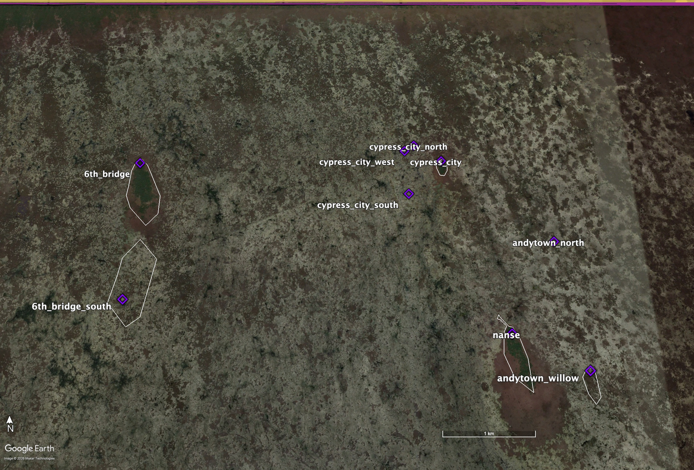
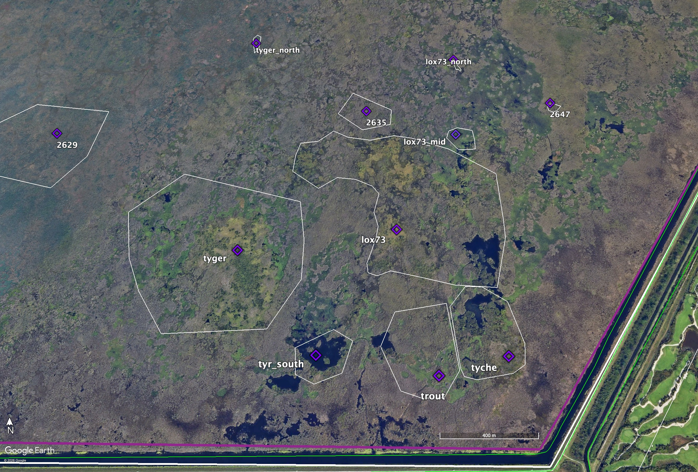

The Greater Everglades Ecosystem encompasses the entire Everglades watershed and estuary, roughly from Orlando FL to the southern tip of the Florida Peninsula. While avian surveys are done throughout this area we focus on methods used in the central Everglades (Water Conservation Areas 1, 2, and 3 and in many years Everglades National Park, 9597 km2, see Figure 1 for locations). This area is predominantly freshwater marsh, with an extremely low elevation gradient (30 mm/km) and soils that vary from calcareous marl soils to deep peats and surficial limestone. Vegetation is largely composed of sawgrass marsh with tree islands of slightly higher elevation interspersed throughout. Tree island composition varies from largely temperate trees and shrubs in the north to tropical hardwoods in the south, and near-continuous cypress habitat in the west.

Everglades restoration focuses on Wood Storks (Mycteria americana), White Ibis (Eudocimus albus), Great Egrets (Ardea alba), and Snowy Egrets (Egetta thula) as monitors for the success of restoration, simply because we only have credible historical quantitative information about breeding responses in the pre drainage periods from a few species. These four species have the best historical record in part because they are white colored and easily identified from the air, but also because several of these were heavily hunted for their valuable plumes during the late 1800s and early 1900s. These species also represent a good cross section of diets and hunting behaviors, and represent a variety of responses to natural and anthropogenically influenced food dynamism (Gawlik 1990, Frederick et al. 2009).

## Regions 

Regions are defined by the Water Conservation Areas (WCAs) managed by the [South Florida Water Management District](http://www.sfwmd.gov/), overseen by the Florida Department of Environmental Protection. The WCAs are a set of diked marshlands in the Everglades system managed for flood control, water supply, and habitat preservation.  
Boundaries are defined by the SFWMD and the park. Shapefiles are provided in the SiteandMethods directory.

- **WCA 1**: AKA "Lox". The Arthur R. Marshall Loxahatchee National Wildlife Refuge covers 221 square miles in Palm Beach County; known for its rare ridge-and-slough ecosystem and pristine tree islands.

- **WCA 2**: Covers 210 square miles in western Palm Beach and Broward counties; acts as a vital transition basin for sheet flow and stormwater storage.

- **WCA 3**: Spans roughly 915 square miles in Broward and Miami-Dade counties; the largest WCA, bordering Everglades National Park to the south.

- **ENP**: Everglades National Park. Water delivery into the park is controlled the entire length of its journey south from Lake Okeechobee and the WCAs through scheduled releases via gates, pumps, and retention areas.

Other regions (Big Cypress, Urban, Florida Bay) are included incidentally in the data but are not the target.

## Subregions

Subregions are defined by a combination of water management practices, local ecology and geology. This combination results in 

Boundaries are defined by roads, levees and other water management structures. Shapefiles are provided in the SiteandMethods directory.

- **1**: Enclosed by levees as a shallow water reservoir, this area experiences one consistent management plan and so is not further divided into subregions. The Wildlife Refuge protects the last significant expanse of native softwater Everglades peat-based wetlands.

- **2a**: Most of the area of WCA 2 is in 2A. It acts as the primary throughput for water moving south toward 3A. 2A has historically suffered from high phosphorus loading from agricultural runoff, triggering extensive marsh restoration efforts.

- **2b**: 2B is a much smaller, compacted basin directly to the south of 2A. It experiences more restricted flows, highly managed target water stages, and distinct levee constraints to prevent over-drainage or excessive flooding of adjacent suburban fringes.

- **3a**: This is by far the largest area in the WCAs and it delivers water to both Everglades National Park and Miami-Dade County. It is the only WCA that is not fully enclosed by levees. A gap left in the mid western side allows for overland flow into Big Cypress National Preserve. For the purposes of wading birds, 3A is divided more finely into ecologically-defined subregions:

  - **3an**: The northern portion of 3A is prone to over-drainage and drying out because of canal systems and levees, resulting in shortened natural water cycles and even regular peat fires. It is dominated by sawgrass and very sparse in tree islands preferred by wading birds. But it does have the largest tree island regularly containing the largest colony of wading birds in the WCAs: Alley North.  
  
  - **3as**: The southern portion of 3A, south of "Alligator Alley", tends to have longer hydroperiods and deeper water levels. As a result, it tends to have the best combination of conditions for wading bird foraging and nesting. It contains the greatest number of well-defined "tree-islands" preferred by wading birds, with a high diversity of tree island structure (mixes of cypress, willow, buttonbush, redbay, wax myrtle, pond-apple, gumbo-limbo and melaleuca).  
  
  - **3ase**: The eastern corner of 3A is divided from 3as by the Miami Canal.  

- **3b**: The southeast corner of WCA 3, separated from WCA 3A by the L-67 levees. This area recharges coastal groundwater levels to the east and prevents over-seepage. The water quality is rated as poor due to the introduction of nutrient-rich water from the northern end. High phosphorus levels have resulted in the decline of native sawgrass and increase of invasive cattails.  

- **inlandenp**: ENP subregions are defined by coastal influence. The inland subregion is more similar to the WCAs, with freshwater sloughs, sawgrass marshes, and hardwood hammocks. Water levels shift dramatically between wet and dry seasons, but are not tidally influenced.

- **coastalenp**: The coastal subregion includes saltwater bays and tidal creeks, where the tides and the salinity rise and fall daily. The coastal subregion does not include Florida Bay, which is entirely marine.

## Colonies

Observers in the field record a waypoint when counting birds. This waypoint is then double-checked against satellite imagery to ensure the location represents where the birds were, not where the human physically was when counting (the difference can be significant when counting from a moving plane or an airboat at the edge of an island). This will become the official location of the colony in the colonies.csv (see Figures 2 and 3). Once a location has been established, field GPS units contain the waypoint and colony name, so that re-recording is not necessary.  
Note: In the early years of the project, researchers did not have easy access to satellite imagery to always confirm their waypoints. To compound the problem, these earlier waypoints also contain much more error as a result of less accurate equipment. Nonetheless, all waypoints associated with data have been vetted post hoc by comparing to satellite imagery from the year of record (or as close as available) to ensure that the colony assignment is logical, or corrected when necessary. All historic colonies have been assigned an official name and ID consistent across time.

Of course, the actual location of wading bird colonies in the Everglades is much more nuanced than a single waypoint. To more accurately represent that, we also create colony polygons for each official colony location. The complexity of decision-making required to create a polygon exists on a spectrum from well-defined tree island to clustering of data points.

### Tree Islands

For well-defined tree islands like those in WCA 3 (Figure 2), creating a polygon can be as simple as outlining the island in the satellite imagery. Field observers typically place the waypoint at the northern tip of the island. This is partly convention, and partly because the combination of geography and water management tends to create the largest hummocks (best for nesting) at the northern end of the island. The actual area of greatest density and the spread of birds across the island varies from year to year within the polygon. Tree islands in the Everglades move, degrade and reform over time. The history of a tree island is tracked over time using satellite imagery, and the polygon is shaped to encompass all of the island's boundaries throughout it's time hosting wading bird colonies.

### Clustering

Nesting also occurs in areas like WCA 1 (Figure 3) that do not contain well-defined tree islands separated by sloughs and sawgrass. These areas may contain long ridges of trees, or clusters of small islands. Birds may spend one year on one ridge and the next year on the one next to it. In a particularly large year, they may utilize every island in a cluster, while in a poor year they choose one tiny island and all crowd in. The best analog to the singular tree island above is to define the cluster of islands as one colony location. In this case, the polygon is shaped to include every location with a recorded count inside the polygon. Boundaries between polygons are defined by distance and the birds' behavior. As a general rule, locations further from the edge of a polygon than the width of the existing cluster are considered a new colony location if they occur in the same year as the existing colony. Researcher impressions can modify this rule as appropriate.